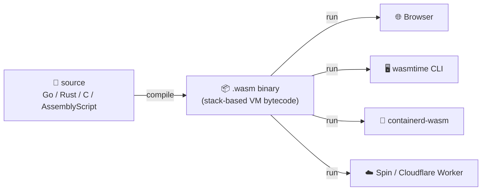
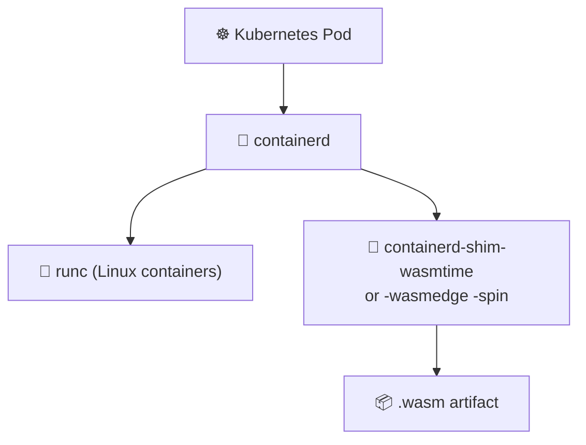

# 📖 Reading 12 (Bonus) — WebAssembly Containers: A Different Kind of Portability

> 🎁 **This is a bonus reading**, paired with Lab 12. Optional, for students chasing the frontier of portable runtimes.

---

## 1. The Problem WebAssembly Solves (on the Server)

Containers solved "**ships across machines**". But they did *not* solve:

* 🐌 **Cold-start time** — a Go container starts in ~1-2 s. A WASM module starts in **~1 ms**
* 📦 **Size** — even with multi-stage, a Go container is ~15 MB. A WASM module is **~1-3 MB**
* 🏛️ **Isolation** — containers share the host kernel (Lecture 5). WASM modules run in a **sandbox with no system calls** by default — stronger isolation than containers, lighter than VMs
* 🌐 **CPU portability** — `linux/amd64` vs `linux/arm64` vs Apple Silicon. One WASM module runs on **all of them**, unchanged

For high-fan-out, latency-sensitive workloads (edge functions, plugin systems, multi-tenant SaaS), these wins matter.

> 🤔 **Think:** Cloud Run cold-started QuickNotes in ~1.5 s in Lab 10. What workloads would benefit from booting in 1 ms instead?

---

## 2. A Compressed History

* 🌐 **2015** — Mozilla, Google, Microsoft, Apple announce **WebAssembly** as a successor to asm.js
* 📜 **March 2017** — WebAssembly 1.0 specification published
* 🪟 **2017-2019** — Adopted by **all four major browsers** as a stable feature
* 🖥️ **2019** — **WASI** (WebAssembly System Interface) proposed — a POSIX-like ABI for running WASM **outside** the browser (CLI tools, server-side modules)
* 🚀 **2020** — Fermyon founded; **Spin** framework launches the "WASM containers" pattern
* 🧩 **2022-2023** — containerd gains **WASM shims**; Kubernetes can schedule a `crun-wasmtime` "container" that's actually a WASM module
* 🌍 **2024-2026** — Cloudflare Workers, Fastly Compute@Edge, Fermyon Cloud — mainstream edge-compute platforms ship WASM-first

---

## 3. WASM 101



* 🧠 WebAssembly is a **stack-based virtual machine instruction set** — like a portable, compact CPU
* 🔒 **Capability-based sandbox**: by default no filesystem, no network, no clock. You grant *only* what's needed
* 📦 Multiple source languages compile to it: Rust (best support), C/C++, Go (via TinyGo), AssemblyScript

```text
.wasm = bytecode + module imports/exports + type signatures
```

---

## 4. WASI: WebAssembly System Interface

In the browser, WASM accesses the world through JavaScript bindings. On the server, **WASI** is the standard ABI:

| WASI API | What it gives |
|----------|---------------|
| `wasi:cli/stdio` | stdin/stdout/stderr |
| `wasi:filesystem` | Pre-opened directory handles only (no `/`) |
| `wasi:sockets` | TCP/UDP (limited) |
| `wasi:clocks` | Monotonic + wall clocks |
| `wasi:random` | Entropy source |

* 🔒 **Capability model**: the runtime mounts a directory like `--dir=.::./data` — the module sees `./data` but **cannot** see `/etc/passwd` or `/`
* 🪶 No syscalls smuggled in — every interaction with the OS is an explicit WASI import

---

## 5. Spin: The "WASM Containers" Pattern

[Fermyon Spin](https://www.fermyon.com/spin) is the easiest entry to server-side WASM:

```toml
# spin.toml
spin_manifest_version = 2

[application]
name = "quicknotes-wasm"
version = "0.1.0"

[[trigger.http]]
route = "/..."
component = "quicknotes"

[component.quicknotes]
source = "main.wasm"
allowed_outbound_hosts = []
```

```bash
# build the WASM module (Go via TinyGo, or Rust, or…)
$ tinygo build -o main.wasm -target=wasi ./...
# or for Spin's preferred path: spin new ... → spin build

# run locally
$ spin up
# deploy to Spin Cloud (free tier)
$ spin deploy
```

* ⚡ Spin starts a new instance per request — true serverless. Cold starts measured in **microseconds**
* 🌐 Each Spin component is its own WASM module with **its own** capability list — you cannot accidentally call code in another component

---

## 6. WAGI: Even Simpler, "CGI for WASM"

For workloads that look like CGI (HTTP in, HTTP out, no fancy state), the **WAGI** executor maps stdin/stdout to HTTP:

```toml
[component.quicknotes]
source = "main.wasm"
executor = { type = "wagi" }
```

* 📨 The WASM module reads the HTTP request from stdin (CGI variables), writes the HTTP response to stdout
* 🪶 No HTTP server needed inside your module — the runtime is the server
* 🧪 Lab 12 uses WAGI to keep the QuickNotes WASM port minimal

---

## 7. Compared with Traditional Containers

| Dimension | Docker container (Lab 6) | WASM module (Lab 12) |
|-----------|--------------------------|----------------------|
| Cold start | ~200 ms – 2 s | ~1 ms |
| Size | 15-200 MB | 1-3 MB |
| CPU portability | Per-arch image | Single artifact |
| Isolation | Linux kernel namespaces | Capability sandbox (stronger than namespaces, weaker than VM) |
| Mature ecosystem | ✅ massive | 🟡 growing fast, still rough edges |
| Multi-tenant safety | OK | Excellent |
| Long-running, stateful workloads | ✅ | ⚠️ (single-process model) |
| `apt install` arbitrary OS deps | ✅ | ❌ (no shell, no syscalls beyond WASI) |

* 🎯 **Sweet spot for WASM**: edge, plugin systems, multi-tenant SaaS request handlers, IoT, browser companion code
* 🪤 **Bad fit for WASM (today)**: heavy DB clients, persistent processes, anything needing arbitrary syscalls

---

## 8. WASM in Kubernetes: containerd Shims



* 🧩 A `RuntimeClass: wasmtime` (Kubernetes feature) lets a pod's containers run as **WASM modules** instead of Linux containers
* 🌐 Major cloud K8s providers (GKE, AKS, EKS) support this in preview as of 2024-2025
* 🎁 **K8s scheduling + WASM runtime** = put microservice plugins next to their users at the edge, with strong isolation

---

## 9. The Cloudflare / Fastly / Vercel Edge Model

These platforms run WASM modules at **300+ POPs** worldwide:

* 🌍 Your request hits the **nearest** POP (typically <30 ms RTT)
* ⚡ A fresh WASM instance starts per request — measured in **microseconds**
* 💸 Pricing is per-request, not per-instance-hour — perfect for spiky traffic
* 🛡️ Each tenant's WASM is sandboxed from every other tenant's — multi-tenant by design

* 🎯 *This* is where WASM-on-server has decisively won — edge platforms, where Cold-Start latency dominates the user experience

---

## 10. The Honest Trade-offs (2026)

| ✅ WASM wins | ⚠️ WASM struggles |
|------------|-------------------|
| Cold start, size, portability | Library ecosystem (esp. databases) |
| Multi-tenant isolation | Long-running stateful workloads |
| Browser + server with same artifact | Debugging tools (still maturing) |
| Sandbox is "deny by default" | TinyGo (the Go-to-WASM compiler) doesn't support all of Go's stdlib |
| Standard ABI (WASI) growing | Cgo, reflection, large goroutine fleets |

> 💡 The Go-specific gotcha: **standard `go build -o main.wasm` produces a WASM module that runs only in browsers** (with the Go runtime + JS glue). For server-side WASM you typically want **TinyGo** (`tinygo build -target=wasi`), which produces a smaller, WASI-compliant binary with a stripped-down stdlib.

---

## 11. Lab 12 Preview

Lab 12 is the **WASM bonus lab**. Two tasks (no Bonus row — the whole lab is bonus):

* 🔨 **Task 1 (6 pts):** Build a minimal `time` endpoint (returns current Moscow time as JSON) in Go → WASM via TinyGo → packaged as a Spin component running under WAGI. Compare deployed size vs the QuickNotes Docker image
* 🏎️ **Task 2 (4 pts):** Benchmark request latency: warm Cloud Run (Lab 10) vs warm `spin up` (Lab 12). Then compare cold-starts. Plot the distributions and explain what dominates each curve
* 📜 Deliverable: `submissions/lab12.md` — spin.toml, build sizes, perf numbers, written reflection

---

## 12. Resources

* 📕 *WebAssembly: The Definitive Guide* — Brian Sletten (O'Reilly, 2022)
* 📗 [WebAssembly Spec](https://webassembly.github.io/spec/) — the actual spec; surprisingly readable
* 📘 [WASI documentation](https://wasi.dev/) — capability-based system interface
* 📗 [Fermyon Spin docs](https://developer.fermyon.com/spin) — quickest start to server-side WASM
* 🎥 [Lin Clark — *A cartoon introduction to WebAssembly*](https://hacks.mozilla.org/2017/02/a-cartoon-intro-to-webassembly/) — the canonical visual primer
* 📝 [Cloudflare Workers — WASM at the edge](https://blog.cloudflare.com/webassembly-on-cloudflare-workers/) — production case study
* 📝 [WASI Preview 2 update (2024)](https://bytecodealliance.org/articles/wasi-preview-2-launch) — the latest milestone

> 🎯 **Remember:** Containers won the 2014-2020 era by making "ship anywhere on Linux" trivial. WebAssembly is making a credible bid for the 2025-2030 era by adding **"ship to any CPU, with capability-based safety, in 1 millisecond"**. Whether it dethrones containers or coexists with them is the open question of the decade.
